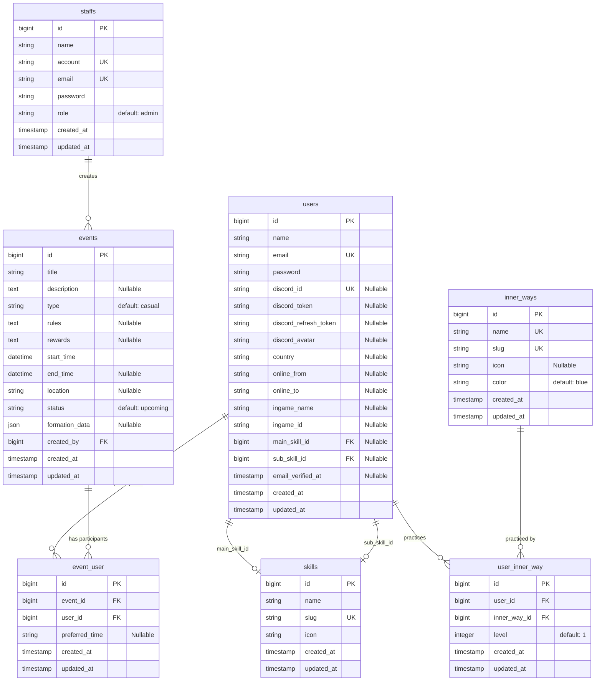

# Entity Relationship Diagram (ERD)

Sơ đồ quan hệ thực thể cho hệ thống, mô tả các bảng chính và mối quan hệ giữa chúng.

## Giải thích quan hệ

1. **Users & Skills**:
   - Một `User` có thể chọn một `main_skill` và một `sub_skill` từ bảng `skills`.
   - Quan hệ: Một-Nhiều (Skills -> Users), nhưng cụ thể là user giữ khóa ngoại.

2. **Users & InnerWays**:
   - Quan hệ Nhiều-Nhiều thông qua bảng trung gian `user_inner_way`.
   - Mỗi liên kết lưu thêm thuộc tính `level` (cấp độ nội công của user đó).

3. **Users & Events**:
   - Quan hệ Nhiều-Nhiều thông qua bảng trung gian `event_user`.
   - Bảng trung gian lưu thêm `preferred_time` (thời gian mong muốn tham gia của user).

4. **Staffs & Events**:
   - Một `Staff` (admin/master) tạo ra nhiều `Event`.
   - `Event` lưu `created_by` trỏ tới `staffs.id`.
