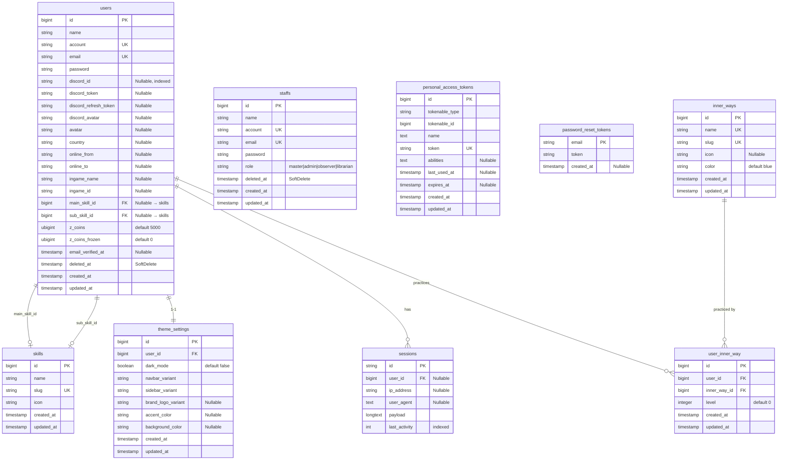
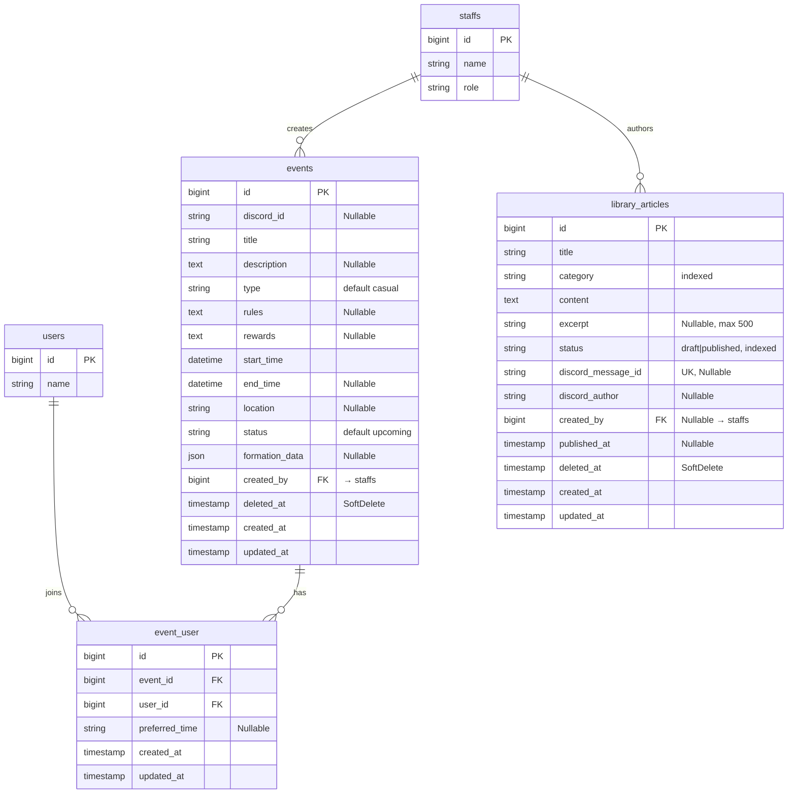
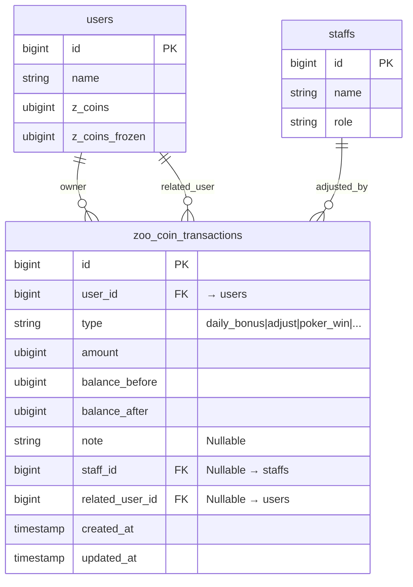
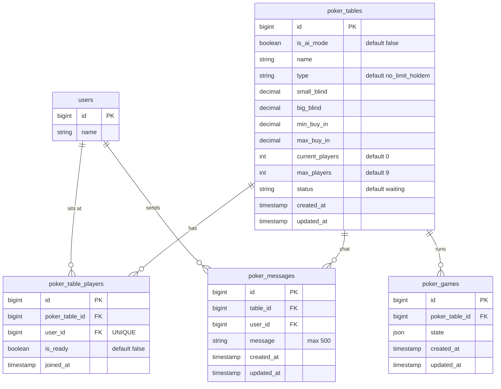
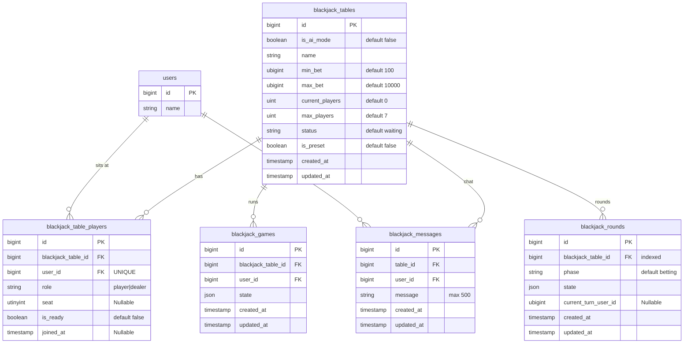
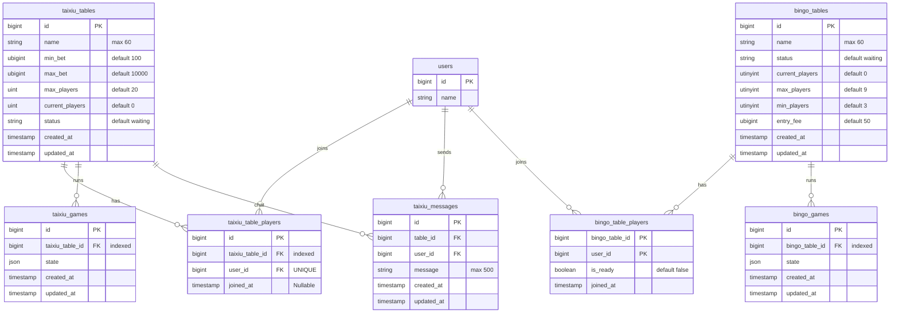
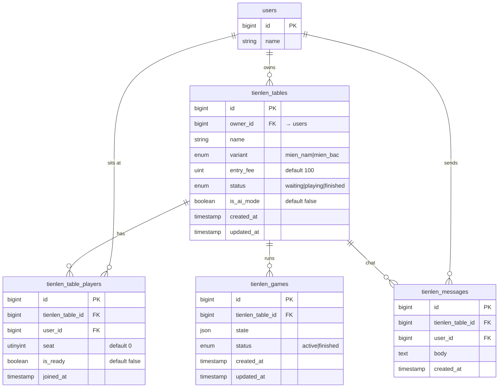
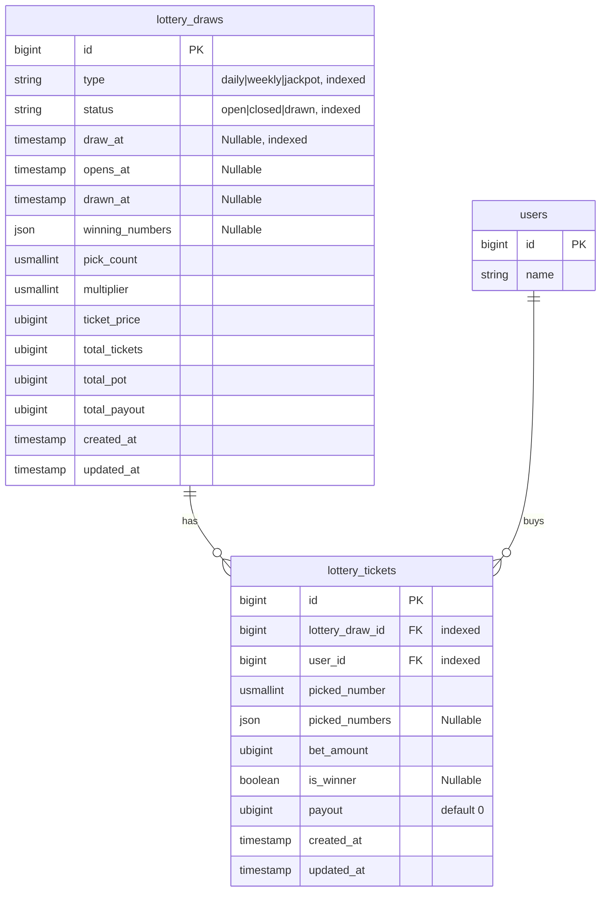

# Entity Relationship Diagram (ERD)

Sơ đồ quan hệ thực thể cho hệ thống The Zoo.  
Các bảng được nhóm theo chức năng; sơ đồ chia thành nhiều nhóm để dễ đọc.

---

## 1. Core — Người dùng & Staff



---

## 2. Events & Thư Viện



---

## 3. Tài chính — Zoo Coins



---

## 4. Entertainment — Poker



---

## 5. Entertainment — Blackjack



---

## 6. Entertainment — Tài Xỉu & Bingo



---

## 7. Entertainment — Tiến Lên



---

## 8. Lottery



---

## 9. Infrastructure (Queue, Cache, Jobs)

> Các bảng này được quản lý bởi Laravel framework, không cần chỉnh sửa thủ công.

| Bảng | Mục đích |
|------|----------|
| `jobs` | Queue jobs đang chờ xử lý |
| `job_batches` | Batch jobs (xử lý nhóm) |
| `failed_jobs` | Jobs thất bại, cần retry |
| `cache` | Cache key-value |
| `cache_locks` | Mutex locks cho cache |
| `sessions` | Lưu session người dùng (driver: database) |

---

## Tóm tắt quan hệ giữa các nhóm

```
users ─────────────────────────────────────────────────────────────────
  │  m:1 skills (main_skill, sub_skill)
  │  1:1 theme_settings
  │  m:n events           (qua event_user)
  │  m:n inner_ways       (qua user_inner_way)
  │  m:n poker_tables     (qua poker_table_players)
  │  m:n blackjack_tables (qua blackjack_table_players)
  │  m:n taixiu_tables    (qua taixiu_table_players)
  │  m:n bingo_tables     (qua bingo_table_players)
  │  m:n tienlen_tables   (qua tienlen_table_players)
  │  1:m zoo_coin_transactions
  └  1:m lottery_tickets

staffs ────────────────────────────────────────────────────────────────
  │  1:m events (created_by)
  │  1:m library_articles (created_by)
  └  1:m zoo_coin_transactions (staff_id)

Game tables (poker/blackjack/taixiu/bingo/tienlen) ────────────────────
  └  1:m *_games, *_messages, *_table_players (per-game pattern)

lottery_draws ─────────────────────────────────────────────────────────
  └  1:m lottery_tickets
```

---

## Thống kê schema

| Nhóm | Số bảng |
|------|---------|
| Core (users, staffs, auth) | 7 |
| User profile (skills, inner_ways) | 3 |
| Events & Library | 3 |
| Tài chính | 1 |
| Poker | 4 |
| Blackjack | 5 |
| Tài Xỉu | 4 |
| Bingo | 3 |
| Tiến Lên | 4 |
| Lottery | 2 |
| Infrastructure | 6 |
| **Tổng** | **42** |
